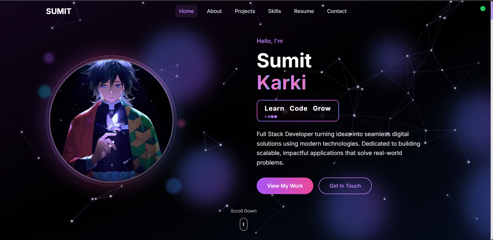

# 💼 My Portfolio Website

A personal portfolio website showcasing my skills, projects, and contact information. Built using **Next.js** and **Tailwind CSS**, and deployed on **Netlify**.



## 🌐 Live Site

👉 [Visit Portfolio](https://sumitportfolio18.netlify.app)

---

## 📌 Features

- ⚡ Fast and responsive layout
- 🧠 Built with Next.js for optimal performance
- 🎨 Tailwind CSS for modern UI styling
- 📱 Mobile-first design
- 🛠 Project showcase section
- 📞 Contact form integrated
- 🌙 Dark mode ready (if added)
- 🚀 Hosted on Netlify

---

## 📂 Technologies Used

- **Next.js**
- **React.js**
- **Tailwind CSS**
- **HTML5 & CSS3**
- **Netlify** (for deployment)

---

## 📷 Screenshots

> All screenshots are stored inside `/Screenshot` folder.

---

## 🧠 How to Run Locally

1. **Clone the repository**

```bash
git clone https://github.com/sumitkarki188/Portfolio-Website.git
cd Portfolio-Website
